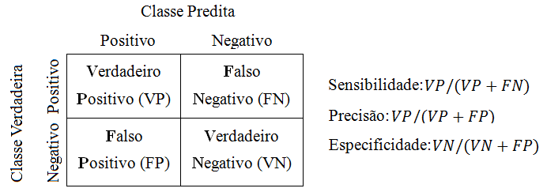
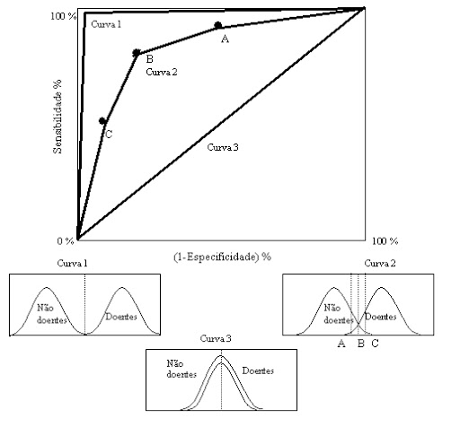
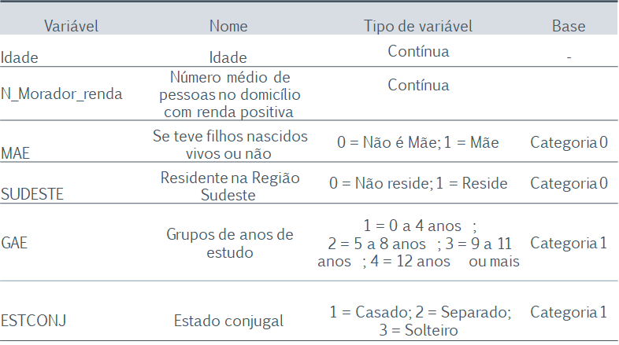
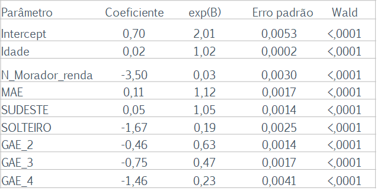
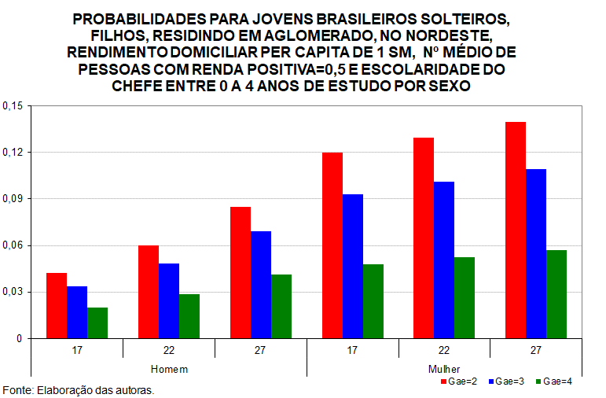

layout: true
<div style="position: absolute;right:50px;top:11px;color:gray;">`r rmarkdown::metadata$author` - `r rmarkdown::metadata$institute`</div>

```{r xaringan-tile-view, echo=FALSE}
xaringanExtra::use_tile_view()
```


```{r, include=FALSE}
xaringanExtra::use_logo('fig/logo.png')
```


```{r  adds a share bar to your slides, echo=FALSE}
xaringanExtra::use_share_again()
```

```{r xaringan-scribble, echo=FALSE}
xaringanExtra::use_scribble()
```

```{r xaringan-panelset, echo=FALSE}
xaringanExtra::use_panelset()
```


```{r xaringanExtra-clipboard, echo=FALSE}
htmltools::tagList(
  xaringanExtra::use_clipboard(
    button_text = "<i class=\"fa fa-clipboard\"></i>",
    success_text = "<i class=\"fa fa-check\" style=\"color: #90BE6D\"></i>",
    error_text = "<i class=\"fa fa-times-circle\" style=\"color: #F94144\"></i>"
  ),
  rmarkdown::html_dependency_font_awesome()
)
```


```{r setup, include=FALSE}
# https://ourcodingclub.github.io/2016/11/24/rmarkdown-1.html
knitr::opts_chunk$set(fig.width = 7, fig.height = 5, fig.align = 'center', dpi = 96, cache=TRUE, comment = "", message = F, warning = F)

```

```{r - Packages, echo=FALSE}
library(readr)
library(tidyverse)
library(ggplot2)
library(pander)
library(xaringanExtra)
library(mfx)
library(kableExtra)
library(knitr)

```
---
background-image: url(https://gordoncstewart.files.wordpress.com/2016/01/to-be-or-not-to-be.jpg)
background-size: cover

---


#Regressão Logística


## Roteiro

- Propriedades do Modelo de Regressão Logística
- Testes utilizados nessa modelagem
- Interpretação dos resultados
- Aplicação
- Prática


---
# Regressão Logística

## Aspectos Gerais do MRLog

O MRLog frequentemente é utilizado para analisar dados observacionais ou experimentais de delineamentos inteiramente casualizados nos casos em que a variável resposta assume unicamente dois valores possíveis.

--

Enquanto a variável resposta é categórica com dois níveis, as variáveis explicativas podem ser categóricas ou não.

---
# Regressão Logística


## Perspectiva do MRLog

**Descritivo**: descrever a natureza do relacionamento entre a resposta média e as variáveis regressoras.

**Preditivo**: prever com base nas variáveis explicativas, a probabilidade de um elemento apresentar um dado desfecho.

---

#Regressão Logística


## Aplicações do MRLog

- Identificar características associadas com a ocorrência de uma doença crônica;
- Identificar características associadas com um determinado status;
- Previsão do risco: calcular a probabilidade de consumidores serem inadimplentes ou adimplentes;
- Previsão de paciente aderir a um tratamento medicamentoso;
- Classificar: a empresa encontra-se no grupo de empresas solventes ou insolventes;
- Classificar e-mails em spam ou não;


---
## Características do Modelo: Linear x Logístico
.pull-left[
**Regressão Linear**
- Variável resposta: contínua
- Mínimo Quadrados
- Gráfico: Reta
- $E(Y) = \hat{y}$
]
.pull-right[

**Regressão Logística**
- Variável resposta: binária
- Máxima Verossimilhança
- Gráfico: curva logística no formato da letra S
- $E(Y) = \hat{p}$

]
---

## Gráfico de Ajuste: Linear x Logístico

.pull-left[

```{r, echo=FALSE}
mtcars %>% 
  ggplot(aes(x=mpg, y=vs))+
  geom_point()+
  geom_smooth(method = "lm", se = FALSE)+
  ylab("Valor Predito")+
  xlab("Variável Explicativa")+
  ggtitle("Gráfico - Ajuste Modelo Linear")

```

]
.pull-right[

```{r, echo=FALSE}
mtcars %>% 
  ggplot(aes(x=mpg, y=vs))+
  geom_point()+
  geom_smooth(method = "glm",method.args = list(family = "binomial"), se = FALSE)+
  ylab("Valor Predito")+
  xlab("Variável Explicativa")+
  ggtitle("Gráfico - Ajuste Modelo Logístico")
```

]


---
## Conte-me mais detalhes...

```{r, out.width="70%", echo=FALSE}
knitr::include_graphics("https://media4.giphy.com/media/mlvseq9yvZhba/giphy.gif")

```
---
# Regressão Logística

## Modelos Lineares Generalizados

O Modelo de Regressão Logística (MRLog) faz parte da classe dos Modelos Lineares Generalizados, em que a variável resposta Y pertence à família exponencial. Nesses casos, a relação entre a variável resposta e as variáveis preditoras é realizada por uma função de ligação. 

--

O objetivo dos Modelos Lineares Generalizados é obter para uma variável resposta que não possui distribuição Normal uma relação linear nos parâmetros das variáveis preditoras, ou seja, um preditor linear $\eta = \beta_0 +\beta_1X_{1i}$, a partir de uma função de ligação que relaciona a variável resposta com as variáveis preditoras.

--

A função de ligação utilizada no Modelo de Regressão Logística é a função logit.


---
# Regressão Logística


## Definição

Considere Yi uma v.a. Bernoulli 

$Y_i=0$ ou $Y_i=1$

A distribuição de probabilidade de $Y_i$ é dada por:

$Y_i = 1$ => $P(Y_i=1) = p_i$

$Y_i = 0$ => $P(Y_i=0) = 1 - p_i$

Temos que o valor esperado de $Y_i$:

$E(Y_i) = p_i$


---

# Regressão Logística


## Definição

- O MRLog modela uma probabilidade de ocorrência.

- A resposta média, quando a variável resposta é uma variável binária (1 ou 0), sempre representa a probabilidade $p_i$ para $Y=1$ , dado o nível da variável preditora $X$. 

.center[ $$média(Y) = E(Y)=P(Y=1|x)$$]


---

# Regressão Logística

### Restrições relacionadas com a variável resposta


**1) Valor predito é uma probabilidade**

$0 \leq E(Y_i) = P(Y=1|x) \leq 1$

Tendo em vista que a variável resposta modela uma probabilade,tem-se que seus possíveis valores estarão no intervalo [0;1], portanto, essa variável torna-se inapropriada para uma função de resposta linear.

---

# Regressão Logística

### Restrições relacionadas com a variável resposta


**2) Desfecho não tem distribuição Normal**


 Portanto, os erros não tem distribuição normal

$\epsilon_i = Y_i-(\hat{\beta}_0+\hat{\beta}_1X_{1i})$

Os erros irão assumir dois valores:

$Y_i=1$ => $\epsilon_i = 1-(\hat{\beta_0}+\hat{\beta}_1X_{1i})$


$Y_i=0$ => $\epsilon_i = -(\hat{\beta_0}+\hat{\beta}_1X_{1i})$
---

# Regressão Logística

### Restrições relacionadas com a variável resposta

**3) 𝐷𝑃(𝑌)∝𝐸(𝑌) – Variância não é constante, violação da suposição de homocedasticidade**

$\epsilon_i = y_i - \hat{y_i} = y_i -\hat{p_i}$

$\sigma^2(\epsilon_i) = \hat{p}_i(1-\hat{p}_i) = (\hat{\beta}_0+\hat{\beta}_1X_{1i})(1-\hat{\beta}_0-\hat{\beta}_1X_{1i})$

 - A variância depende do valor de $X_i$

---
# Regressão Logística

##  Transformação Logit da probabilidade *p*


Tendo em vista que a variável resposta $Y$ varia entre 0 e 1, será definida uma transformação da variável resposta de modo que o seu domínio seja ampliado e que a relação entre a variável resposta e as variáveis explicativas seja representada por um preditor linear:

$$\eta = \beta_0 +\beta_1X_{1i}$$

Portanto, em razão da não linearidade da variável resposta, será preciso definir uma quantidade que possibilite a ligação entre $Y$ e $\eta$:

Essa quantidade será o **log(logit de p)**.

---
# Regressão Logística

## Transformação Logit da probabilidade *p*


A função de ligação será estabelecida com a seguinte quantidade:

 .center[$$odds = \frac{p}{1-p}$$]

A **odds** (vantagem) é a razão entre a probabilidade de ocorrência e a probabilidade de não-ocorrência do desfecho de interesse.

---

# Regressão Logística

## Transformação Logit da probabilidade *p*


O logit da variável resposta $Y$ é uma variável contínua que é calculado como o logaritmo natural da vantagem (odds):

.center[$$ logit = ln(odds) =ln \left ( \frac{p}{1-p}  \right ) $$]
---
# Regressão Logística

### Função de Ligação Logit

A linearização do preditor ocorre com o uso da quantidade **logit**.


$$ ln \left ( \frac{p}{1-p}  \right ) = \beta_0 + \beta_1X     $$
Aplicando o exponencial no logit, temos: 


$$ \hat{p_i}= \frac {e^{\beta_0 + \beta_1X}}{1 +e^{(\beta_0 + \beta_1X)}} = \frac {1}{1 +e^{-(\beta_0 + \beta_1X)}} $$

---
# Regressão Logística

### Probabilidade estimada

O MRLog estima a probabilidade de ocorrência de um evento.

$$P(Y=1)= \frac {e^{\beta_0 + \beta_1X}}{1 +e^{(\beta_0 + \beta_1X)}} = \frac {1}{1 +e^{-(\beta_0 + \beta_1X)}}$$

---

# Regressão Logística

## Suposições do Modelo de Regressão Logística


- Nenhuma variável importante foi omitida;
- Ausência de variáveis espúrias;
- Variáveis independentes foram mensuradas corretamente;
- Ausência de  observações influentes;
- As observações são independentes;
- As variáveis independentes não são combinações lineares umas das outras. 


A não observância dos resquisitos do modelo pode produzir estimativas de coeficientes enviesadas ou erros-padrões elevados, o que impossibilita a produção de inferências válidas.


---
# Regressão Logística

##Estimador de Máxima Verossimilhança


Busca a combinação de coeficientes que maximiza a probabilidade da amostra ter sido observada. Sendo assim, procura obter parâmetros que maximize a função de verossimilhança (*L*).

.center[$$L=\prod_{i=1}^nf(x_i,\theta)$$]

A função de verosimilhança é uma medida da informação fornecida pelos dados para os parâmetros de um modelo probabilístico. Produz estimativas para os parâmetros que tornam os dados amostrais mais prováveis.

---
# Regressão Logística

##Estimador de Máxima Verossimilhança para o MRLog


A probabilidade de ocorrência de $Y_i$ é dada por:

$$P(Y_i) = (p_i)^{Y_i}(1-p_i)^{1-Y_i}$$


Com base nessa informação, é definida a função de verossimilhança:

$$L=\prod_{i=1}^n(p_i)^{Y_i}(1-p_i)^{1-Y_i}$$


 $$L = \prod_{i=1}^n\left [  \left ( \frac{\epsilon^{\eta}}{(1+\epsilon^{\eta})} \right )^{Y_i}  \left ( \frac{1}{(1+\epsilon^{\eta})} \right )^{1-Y_i}  \right ]$$

---
# Regressão Logística

##Estimador de Máxima Verossimilhança para o MRLog

Por conveniência de cálculo, nesse ponto, aplica-se o logaritmo natural em ambos os lados da equação de verossimilhança:


 $LogL \sum_{i=1}^n \left \{ \left [Y_iln \left(\frac{e^{\eta}}{1+e^{\eta}} \right)  \right]  + \left [(1 - Y_i)ln \left(\frac{e^{\eta}}{1+e^{\eta}} \right)  \right]     \right \}$
 


---
# Regressão Logística

## Estimação dos Coeficientes do Modelo

A significância estatística dos coeficientes estimados é testada a partir da Estatística de *Wald*, que possui distribuição Normal, com base no erro padrão dos coeficientes.

Hipóteses:

$H_0:\beta_j=0$

$H_1:\beta_j\neq0$


- **Estatística de Wald**

$Wald = \frac{\hat{\beta}_j}{se(\hat{\beta}_j)}~N(0,1)$

---
# Regressão Logística

## Intervalo de Confiança para os parâmetros

Um intervalo de confiança $(1-\alpha)$ para $\beta_j$ é dado por

$\hat{\beta_j} \pm z_{\alpha/2}\hat{se(\beta_j)}$


---

# Regressão Logística

## Valores Preditos

O modelo de regressão logísitca possibilita a obtenção de dos valores preditos, ou seja, é possível obter a probabilidade de ocorrência do desfecho de interesse condicionado às variáveis explicativas.


$$\hat{p_i}= \frac {e^{\hat{\beta}_0 + \hat{\beta}_1X_i}}{1 +e^{(\hat{\beta}_0 + \hat{\beta}_1X_i)}} = \frac {1}{1 +e^{-(\hat{\beta}_0 + \hat{\beta}_1X_i)}}$$
---

# Regressão Logística

## Interpretação - Efeito de $\hat{\beta_j}$ no Logit


- A análise direta do valor do coeficiente reporta o efeito no logaritmo da odds (logit).

- Um coeficiente significativo com sinal POSITIVO indica que a variável está associada com a AUMENTO do logit;

- Um coeficiente significativo com sinal NEGATIVO indica que a variável está associada com a DIMINUIÇÃO do logit;

---

# Regressão Logística  

### Interpretação - Efeito de $exp(\hat{\beta})$ na OR


A odds ratio (OR) compara a probabilidade de ocorrência do evento de interesse para níveis distintos de uma variável explicativa. 

 $$OR=\frac{p_{A_1}/(1-p_{A_1})}{p_{A_2}/(1-p_{A_2})}$$

Tendo em vista que o logit é mensurado na escala logarítmica, a exponenciação do parâmetro de regressão $\beta$ fornece o efeito na OR:


|Quantidade|Interpretação|
|----------|-------------|
|$$exp(\hat{\beta})>1$$  | aumento da OR|
|$$exp(\hat{\beta})<1$$  | diminição da OR|
|$$[exp(\hat{\beta})-1]\times 100 = \%$$  | mudança percentual na OR|


---

# Regressão Logística

## Intervalo de Confiança para OR

- Uma maneira de avaliar a relevância dos coeficientes estimados é pela análise do intervalo de confiança calculados para a OR (**odds ratio**). 


- Quando um intervalo conter o valor 1, não se tem evidências suficientes para concluir que há uma vantagem de ocorrência do desfecho em relação a sua não ocorrência com base na variável explicativa.


---

# Regressão Logística

## Adequação do Modelo - Estatística da Deviance 

A Estatística da Deviance verifica a adequação do ajuste ao comparar o logaritmo da verossimilhança do modelo de pesquisa com o logaritmo da verossimilhança do modelo saturado, modelo que se ajusta completamente aos dados, isto é, para cada observação tem-se um parâmetro. 

--

- Um modelo bem ajustado aos dados apresentará uma elevada verossimilhança e, portanto, uma estatística de Deviance pequena. 

- Para obter uma redução da Deviance, deve-se aumentar o número de parâmetros do modelo, o que deve ser realizado com cautela em razão do princípio da parcimônia.

---

# Regressão Logística

## Adequação do Modelo - Estatística da Deviance

A estatística da Deviance é obtida a partir de:

Deviance = $-2log(L_{M.saturado} - L_{M.pesquisa}) ~\chi^{2}_{n-p}$


*Hipótese*

$H_0$: Modelo de *pesquisa* é tão adequado quanto ao modelo *Saturado*


---

#Regressão Logística

## Adequação do Modelo - Razão de Verossimilhanças

A Estatística da Razão de Verossimilhanças é utilizada para comparar modelos aninhados, ou seja, um modelo reduzido que contém um menor número de parâmetros contidos em um modelo mais  completo. Sendo assim, possibilita comparar o efeito da inclusão de termos na modelagem.


$\lambda$ = 2(*Log_Verossimilhança Completo* - *Log_Verossimilhança M_Reduzido*) $~\chi_{(p-q)}^2$

onde $p$ representa o número de parâmetros do *M_Completo* e $q$ do *M_Reduzido*.


Hipótese:

$H_0$: Modelo reduzido é tão adquando quanto modelo completo.


---
# Regressão Logística

## Adequação do Ajuste - AIC (Akaike Information Criterion)


O AIC é uma mediada obtida a partir do logaritmo da verossimilhança penalizado pelo número de parâmetros do modelo. Quanto menor o valor de AIC, melhor o ajuste do modelo. 

Primeiramente, é calculado o AIC para o Modelo Nulo e em seguida se obtém o AIC para o Modelo de Pesquisa. Para a tomada de decisão, compara-se os dois valores de AIC calculados.


$AIC = -2 LogL+ 2p$

onde L represnta $f(x;\theta)$,a função de verossimilhança do modelo, e $p$ o número de variáveis do modelo de pesquisa.
---
# Regressão Logística

## Adequação do Ajuste - Outros aspectos

### Multicolinearidade
Multicolinearidade  ocorre quando duas ou mais variáveis independentes do modelo apresentam algum nível de correlação. Se há uma elevada multicolinariedade entre algumas vairáveis, o ajuste do modelo pode apresentar coeficientes com erros padrões elevados.
Para avaliar a presença de multicolinearidade utilizar as medidas de *tolerância* e *VIF (variance inflation factor)*

### Observações influentes
A presença de observações influentes pode ocasionar estimativas de coeficientes viciadas.


---

# Regressão Logística

## Qualidade do Ajuste - Pseudo $R^2$


- O Pseudo $R^2$ é uma medida geral de como o modelo se ajusta aos dados.

- Essa medida é semelhante ao $R^2$ obtido na regressão linear múltipla que representa a quantidade de variabilidade explicada pelo modelo. 

--

- O pseudo R-quadrado não é medido em termos de variância, uma vez que na regressão logística a variância é fixada como a variância da distribuição logística padrão. É uma proporção em termos da probabilidade de log.

- O Pseudo $R^2$ é calculado a partir do logaritmo da verossimilhança do modelo nulo (contendo apenas o intercepto) e da verossimilhança do modelo pesquisa. Quanto maior a diferença entre essas duas quantidades, melhor a qualiade do ajuste.

--

$$Pseudo\ R^2 = \frac{-2LogL_{M.nulo}-(-2ogLL_{M.pesquisa})}{-2LogL_{M.nulo}}$$
---

# Regressão Logística

## Qualidade do Ajuste - Teste de Hosmer e Lemeshow

O teste de Hosmer e Lemeshow é utilizado na avaliação da qualidade do ajuste do modelo. O teste consiste em comparar a distribuição dos valores previstos pelo modelo com os valores observados na amostra, tendo por referência a distribição Qui-quadrado e a divisão dos valores sob teste em 10 grupos de igual tamanho. 

$H_0$: proporções observadas e esperadas são iguais => modelo bem ajustado.


---

# Regressão Logística

## Qualidade do Ajuste - Matriz de Confusão

Uma outra maneira de avaliar a qualidade do ajuste do MRLog é obtida por uma tabela de classificação, denominada Matriz de Confusão. Essa tabela relaciona os valores observados na variável resposta com os valores preditos pelo modelo. 

--

Para esse fim, é necessário definir uma regra para classificar os valores preditos (as probabilidades) em uma variável dicotômica que assumirá o valor zero, caso a probabilidade de ocorrência for inferior ao limite estabelecido, ou 1 caso contrário. Em geral, esse limite é estabelecido em 0,5.


---
# Regressão Logística

## Qualiade do Ajuste -  Curva ROC

A Curva ROC (Receiver Operating Characteristic Curve) no contexto do modelo de regressão logística permite avaliar o potencial da capacidade preditiva do modelo estimado a partir da relação entre as medidas de sensibilidade (*verdadeiros positivos*) e de especificidade (*verdadeiros negativos*).


```{r, out.width='70%', fig.align='center',echo=FALSE}


```
---

# Regressão Logística

## Qualidade do Ajuste -  Curva ROC

```{r, out.width='70%', fig.align='center',echo=FALSE}


```

---

# Regressão Logística

## Qualidade do Ajuste -  Curva ROC

A partir da área definida sob a curva ROC, se define a medida AUC que quanto mais próximo de 1 indica que o modelo fez uma excelente classificação. Quanto mais próximo de 0,5 o valor da área se aproximar, tem-se que o modelo realiza uma classificação aleatória. Valores acima de 0,7 são aceitáveis.


---
## Qualidade do Ajuste - Validação do Modelo

A análise da qualidade da classificação é realizada dividindo o conjunto de dados em dois:

 - uma parte para estimação do modelo (treinamento)
 - outra parte para testar a eficiência da classificação (classificação)

Para utilizar o modelo de regressão logística para classificação de dois grupos, utiliza-se o seguinte critério:

 se P(Y=1) > 0,5 então classifica-se Y=1
 se P(Y=1) < 0,5 então classifica-se Y=0
 
---
# Regressão Logística

## Nossa, que interessante!

 
```{r, out.width="70%", fig.align='center',echo=FALSE}
knitr::include_graphics("https://media1.giphy.com/media/Nm8ZPAGOwZUQM/giphy.gif")
```

---

class: inverse, center, middle

# Regressão Logística - Aplicação

---

# Regressão Logística - Aplicação


Camarano, A. A., Kanso, S., Mello, J. L., & Andrade, A. (2006). Estão fazendo a transição os jovens que não estudam, não trabalham e não procuram trabalho?. Transição para a vida adulta ou vida adulta em transição, 259-290.

```{r, out.width='70%', fig.align='center', echo=FALSE}

```

---
# Regressão Logística - Aplicação


Ajuste de um Modelo de Regressão Logística para identificar o impacto de variáveis na desfecho de interesse: jovem não estudar e nem trabalhar - *"nem nem"*.


| $Y=1$   |Jovem não estuda e nem trabalha|
|:-------:|-------------------------------|
| $Y=0$   |Jovem estuda ou trabalha ou os dois|


Jovens: pessoas com idade entre 15 e 29 anos.


Dados: IBGE/Censo Demográfico de 2000.

---
# Regressão Logística - Aplicação

## Codificação das variáveis

```{r, out.width='100%', fig.align='center', echo=FALSE}

```

---

# Regressão Logística - Aplicação

## Coeficientes estimados 


```{r, out.width='70%', fig.align='center', echo=FALSE}


```

--
Sinal dos Coeficientes
```{r, out.width='50%', fig.align='center', echo=FALSE}
knitr::include_graphics('fig/fig3.png')
```

---

# Regressão Logística - Aplicação

##Resultados - Probabilidades


```{r, out.width='70%', fig.align='center', echo=FALSE}

```

---
# Regressão Logística - Aplicação

##Resultados - Probabilidades


```{r, out.width='70%', fig.align='center', echo=FALSE}
knitr::include_graphics('fig/fig5.png')
```

---
# Regressão Logística

## Que tal ajustarmos um modelo?
 
```{r, out.width="70%", fig.align='center',echo=FALSE}
knitr::include_graphics("https://media3.giphy.com/media/CjmvTCZf2U3p09Cn0h/giphy-downsized.gif")
```

---

class: inverse, center, middle

# Regressão Logística - Exercício


---
# MRLog - Exercício

## Ajuste MRLog no R

**Função glm** – utilizada para ajustar modelos lineares generalizados e obter estimativas pontuais para os parâmetros e algumas medidas de qualidade de ajuste.

Especificar:

- Variável dependente
- Variáveis explicativas
- Family - a distribuição de probabilidade da variável resposta do modelo
- Link – função de ligação

As estatísticas de adequação e diagnóstico serão obtidas pelo pacote **blorr**.

---
# MRLog - Exercício

## Data Titanic

Data sobre o Titanic, navio construído na Irlanda que naufragou quatro dias após sua viagem inaugural, em 1912. Quando construído, o navio prometia ser o mais luxuoso e seguro de sua época. Entretanto, estudos posteriores indicaram falhas no sistema de segurança e evacuação. A estimativa é de 1514 mortes entre os 2224 passageiros, ou seja, aproximadamente 68% da tripulação.

---

# MRLog - Exercício

.panelset[
.panel[.panel-name[R Code]
```{r data, echo=TRUE}
#install.packages("titanic")
library(titanic)
data<-titanic_train

```
]

.panel[.panel-name[Data]

```{r, echo=FALSE}
str(data)

```
]
]

---
# MRLog - Exercício

**Parametrização do modelo**


|Variável | Nome | Definição | Categoria de base|
|---------|:----:|:----------|:----------------:|
| Sexo    | Sex  | Fem x Masc|  Masculino |
| Classe de embarque| Pclass |1ª,2ª,3ª | 3ª|
| Idade   | Age  | anos - contínua| -|

---
# MRLog - Exercício

```{r, echo=TRUE}

#Remoção de missing values
data<-data[complete.cases(data),]


#Recodificação da variável Survived
data$Survived<-factor(data$Survived,
                      labels = c("Not survived","Survived"),
                      levels = c(0,1))


#Recodificação da Variável Sexo para factor
#Categoria de base: male
data$Sex<-factor(data$Sex,
                 ordered = TRUE,
                  levels = c("male","female"))


#Recodificação do nível 3ª classe para valor zero - categoria de base
data$Pclass[data$Pclass==3]<-0
data$Pclass<-factor(data$Pclass)

 
```

---
# MRLog - Exercício

## Análise Exploratória

.pull-left[
```{r plot1, eval=FALSE}
data %>% 
 ggplot(aes(x = Survived)) +
  geom_bar()
  
  
```
]
.right-graph[

```{r plot1-label-out, ref.label="plot1",echo=FALSE,fig.dim=c(4.8, 4.5), out.width="50%"}
```

]

---
# MRLog - Exercício

## Análise Exploratória

.pull-left[
```{r plot2, eval=FALSE}
data %>% 
  ggplot(aes(x=Survived,fill=Sex))+
  geom_bar(position="fill")+
  scale_fill_manual(values=c("blue","red"))
```
]
.right-graph[

```{r plot2-label-out, ref.label="plot2", echo=FALSE,fig.dim=c(4.8, 4.5), out.width="50%"}
```

]

---
# MRLog - Exercício

## Análise Exploratória

.pull-left[
```{r plot3, eval=FALSE}
data %>% 
  ggplot(aes(x=Survived,fill=Pclass))+
  geom_bar(position="fill")
```
]
.right-graph[

```{r plot3-label-out, ref.label="plot3", echo=FALSE,fig.dim=c(4.8, 4.5), out.width="50%"}
```

]


---
# MRLog - Exercício

## Análise Exploratória

.pull-left[
```{r plot4, eval=FALSE}
data %>% 
 ggplot(aes(x=factor(Survived),y=Age,fill=factor(Survived)))+
  geom_boxplot()
```
]
.right-graph[

```{r plot4-label-out, ref.label="plot4", echo=FALSE,fig.dim=c(4.8, 4.5), out.width="50%"}
```

]

---
# MRLog - Exercício

.panelset[

.panel[.panel-name[R Code]

```{r ajuste, eval=FALSE}
#Ajuste do Modelo

m1<-glm(Survived~Sex+Pclass+Age, family = binomial(link="logit"), data=data)
summary(m1)
```

]

.panel[.panel-name[Output]

```{r ajuste1, echo=FALSE}
m1<-glm(Survived~Sex+Pclass+Age, family = binomial(link="logit"), data=data)
summary(m1)
```
]

]

---
# Modelo ajustado 
O modelo ajustado é dado por 

$logito = -0.065 + 1.784Sex_F - 2.581PClass_1 + 1.271 PClass_1+ - 0.037Age$

--
- Todos os coeficientes estimados das variáveis do modelo de pesquisa são estatisticamente significativos e, portanto,diferentes de zero.

--

Efeito das Variáveis na ocorrência do desfecho: Sobrevivência do Passageiro

|Coeficiente | Sinal | Efeito |
|:----------:|:-----:|:------:|
|Sexo_F | Positivo| Aumenta|
|Class_1| Positivo| Aumenta|
|Class_2| Positivo| Aumenta|
|Idade  | Negativo| Diminui|

--

Lembrando: o valor de $B_j$ representa o efeito no logit $p/(1-p)$, ou seja, no log da chance de sobreviver em relação a não sobreviver.
---

# MRLog - Exercício

## OR e interpretação
.panelset[

.panel[.panel-name[R Code]

```{r, eval=FALSE}
exp(cbind(OR=coef(m1),confint(m1)))
```
]

.panel[.panel-name[Output]

```{r, echo=FALSE}
exp(cbind(OR=coef(m1),confint(m1)))
```
]
.panel[.panel-name[Interpretation]

|Variável | OR | Interpretação|
|-------|----|--------------|
|Sex_F   | 5.95 | Mulheres possuem chance de sobrevivência 5,95 vezes maior que homens.
|Pclass1|13,21 | Passageiros da 1ª classe possuem chance de sobrevivência 13,21 vezes maior que chance de sobrevivência dos passageiros da 3ª classe.|
|Pclass2|3,56 | Passageiros da 2ª classe possuem chance de sobrevivência 3,56 vezes maior que chance de sobrevivência dos passageiros da 3ª classe.|
|Age  |0,96 | A cada ano de vida tem-se uma diminuição na chance de sobrevivência na ordem de 0,96.

]
]

---
# Exemplo - Código R

## Valores preditos

Pode-se ainda obter os valores de probabilidade predita pelo modelo para valores específicos da variável explicativa:


#Probabilidades Preditas

```{r}
prob<-function(sex,pclass1,pclass2,age)
  { 1 /(1+exp(-(-0.06500312 + (1.78387550*sex) + (2.58062532*pclass1) + 
       (1.27082605*pclass2) + (-0.03698527*age))))
}

```

|Perfil |Probabilidae|
|---------------------------|------------------|
|Mulher – 40 anos – 1 classe|`r prob(1,1,0,40)`|
|Mulher – 40 anos – 3 classe|`r prob(1,0,0,40)`|
|Homem  – 40 anos – 1 classe|`r prob(0,1,0,40)`|
|Homem  – 40 anos – 3 classe|`r prob(0,0,0,40)`|


---
# Exemplo - Código R

.panelset[
.panel[.panel-name[R Code]

```{r,eval=FALSE}
predito<-predict(m1,type="response")
datap<-cbind(data,predito)

datap %>% 
ggplot(aes(x=Age,y=predito,group=Sex,colour=Sex)) +
  geom_line(size = 1) +
  geom_point(size=1) + 
  labs(title = "Probabilidades Preditas",
       y = "Probabilidade", x = "Idade") + 
  scale_color_manual(values=c("cadetblue", "rosybrown1"))+
  facet_wrap(~Pclass,ncol=1 )
```
]

.panel[.panel-name[Plot]

```{r,echo=FALSE}

predito<-predict(m1,type="response")
datap<-cbind(data,predito)

datap %>% 
ggplot(aes(x=Age,y=predito,group=Sex,colour=Sex)) +
  geom_line(size = 1) +
  geom_point(size=1) + 
  labs(title = "Probabilidades Preditas",
       y = "Probabilidade", x = "Idade") + 
  scale_color_manual(values=c("cadetblue", "rosybrown1"))+
  facet_wrap(~Pclass,ncol=1 )
```

]

]
---
# MRLog - Exercício


.pull-left[
```{r anova, eval=FALSE}
#ANOVA
anova(m1)
```
]

.right-graph[
```{r plot-label-out, ref.label="anova", echo=FALSE,fig.dim=c(4.8, 4.5), out.width="50%"}
```

]
---

# MRLog - Exercício

##### Medidas de Adequação do Modelo

.panelset[

.panel[.panel-name[R Code]

```{r fit_stat, eval=FALSE}
library(blorr)
blorr::blr_model_fit_stats(m1)
```

]

.panel[.panel-name[Output]

```{r fit_stat_out, echo=FALSE}

blorr::blr_model_fit_stats(m1)
```
]

]

---
# MRLog - Exercício

.panelset[

.panel[.panel-name[R Code]

```{r hl_stat, eval=FALSE}
##Estatística Hosmer and Lemeshow
blorr::blr_test_hosmer_lemeshow(m1)
```

]

.panel[.panel-name[Output]

```{r hl_stat_out, echo=FALSE}

blorr::blr_test_hosmer_lemeshow(m1)
```
]

]

---
# MRLog - Exercício

.panelset[

.panel[.panel-name[R Code]

```{r mat_conf, eval=FALSE}
## Matriz de Confusão

blorr::blr_confusion_matrix(m1)
```

]

.panel[.panel-name[Output]

```{r mat_conf_out, echo=FALSE}

blorr::blr_confusion_matrix(m1)
```
]

]


---
# MRLog - Exercício


#### Curva ROC


.panelset[
  
.panel[.panel-name[R code]

```{r,eval=FALSE}
library(pROC)
roc1<- plot.roc(data$Survived,fitted(m1))

plot(roc1,
     print.auc=TRUE,
     auc.polygon=TRUE, 
     auc.polygon.col="lightblue",
     print.thres=TRUE
     )
```
]

.panel[.panel-name[Plot]
```{r,echo=FALSE,warning=FALSE, comment=FALSE, message=FALSE}
library(pROC)
roc1<- plot.roc(data$Survived,fitted(m1))

plot(roc1,
     print.auc=TRUE,
     auc.polygon.col="lightblue",
     print.thres=TRUE
     )
```

]

]
---
# MRLog - Exercício

.panelset[
  
.panel[.panel-name[R code]

```{r,eval=FALSE}
#Validação por Treinamento e Teste
library(caret)
set.seed(123)
indice <- createDataPartition(data$Survived, p = .80, list = FALSE)

#Aplicação do Índice na base
treinamento <- data[indice, ]
dim(treinamento)
teste <- data[-indice, ]
dim(teste)

#Ajuste do modelo de treinamento

m_train<- glm(Survived~Sex+Pclass+Age, family = binomial(link="logit"), data=treinamento)
summary(m_train)

#Predição da variável resposta no conjunto de teste
teste$Survived_pred <- predict(m_train, teste, type = "response")
teste$classifica<-ifelse(teste$Survived_pred>0.5,"Survived","Not Survived")

# Visualização dos valores observados, preditos e classificados
valida<-teste[,c("Survived","Survived_pred","classifica")]
DT::datatable(valida, editable = list(target = 'row'))

```
]

.panel[.panel-name[Output]
```{r,echo=FALSE,warning=FALSE, comment=FALSE, message=FALSE,tidy=TRUE}
library(caret)
set.seed(123)
indice <- createDataPartition(data$Survived, p = .80, list = FALSE)

#Aplicação do Índice na base
treinamento <- data[indice, ]
teste <- data[-indice, ]


#Ajuste do modelo de treinamento
m_train<- glm(Survived~Sex+Pclass+Age, family = binomial(link="logit"), data=treinamento)


#Predição da variável resposta no conjunto de teste
teste$Survived_pred <- predict(m_train, teste, type = "response")
teste$classifica<-ifelse(teste$Survived_pred>0.5,"Survived","Not Survived")

# Visualização dos valores observados, preditos e classificados

valida<-teste[,c("Survived","Survived_pred","classifica")]
DT::datatable(valida, editable = list(target = 'row'))

```

]

]


---
# MRLog - Exercício

.panelset[

.panel[.panel-name[R Code]

```{r step, eval=FALSE}

blorr:: blr_step_aic_both(m1)
```

]

.panel[.panel-name[Output]

```{r step_out, echo=FALSE}

blorr:: blr_step_aic_both(m1)
```
]

.panel[.panel-name[R Code Plot]

```{r step_plot, eval=FALSE}

m1 %>%
  blr_step_aic_both() %>%
  plot()
```

]

.panel[.panel-name[Plot]

```{r step_plot_out, echo=FALSE, comment=FALSE, message=FALSE}
m1 %>%
  blorr::blr_step_aic_both() %>%
  plot()
```
]


]

---
# Regressão Logística

## Bom trabalho pessoal!
 
```{r, out.width="70%", fig.align='center',echo=FALSE}
knitr::include_graphics("https://media2.giphy.com/media/QLtO7Hs5FXtJe/giphy-downsized.gif")
```

